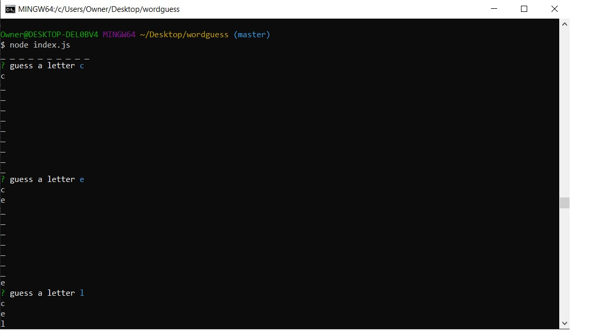
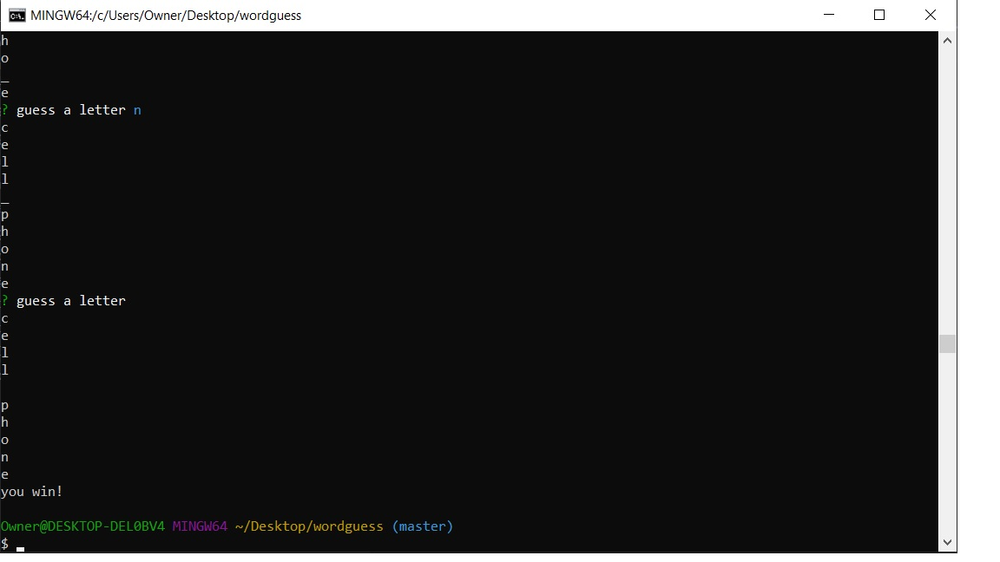
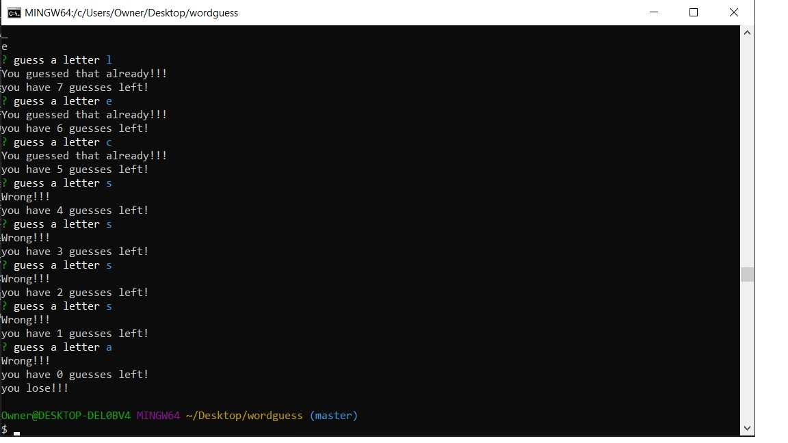

# wordguess
## user will guess a letter in the cmd line
## if it is there, it will show the letter and prompt user to guess again until the word is guessed
## if it isn't there, the user will be prompted and the number of guesses decreases

